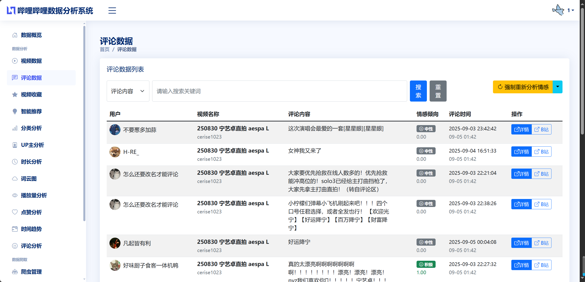
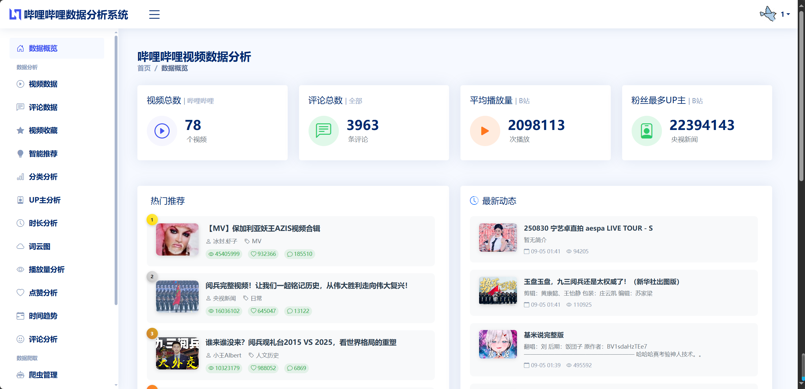
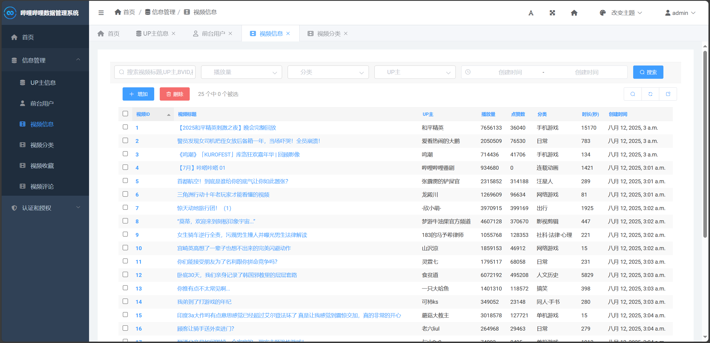
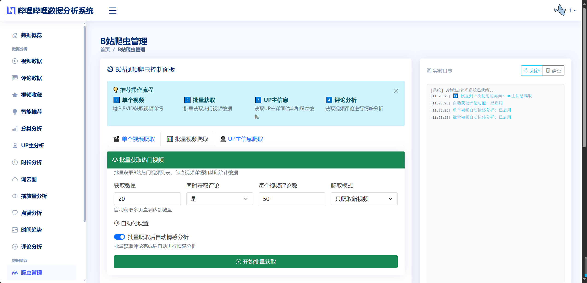
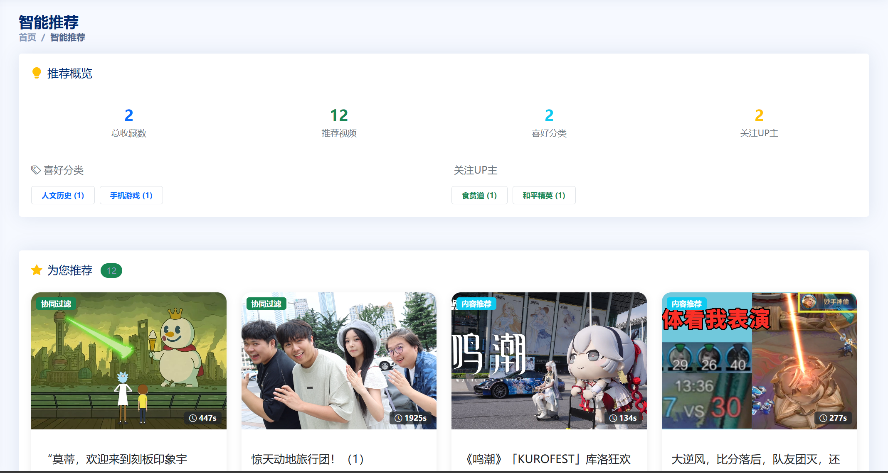

## 计算机大数据毕业设计Python+Django的哔哩哔哩数据可视化分析推荐系统 视频推荐系统(源码+LW+PPT+讲解)


## 要求
### 源码有偿！一套(论文 PPT 源码+sql脚本+教程)

### 
### 加好友前帮忙start一下，并备注哔哩哔哩分析26
### 我的QQ号是 1679232425 或者798059319或者2827724252 或者微信:biyesheji1698 或者 bysj2023nb

# 

### 加qq好友说明（被部分 网友整得心力交瘁）：
    1.加好友务必按照格式备注
    2.避免浪费各自的时间！
    3.当“客服”不容易，repo 主是体面人，不爆粗，性格好，文明人。
## 介绍描述


```
本项目基于Python+Django框架构建了一个完整的哔哩哔哩视频数据可视化分析与推荐系统。该系统通过智能爬虫技术自动采集B站热门视频、评论和UP主信息，运用数据分析算法对视频播放量、用户情感倾向、分类分布、UP主影响力等多个维度进行深度挖掘。系统集成了基于协同过滤和内容推荐的双重算法引擎，结合机器学习情感分析技术，为用户提供个性化视频推荐服务。采用ECharts可视化技术实现了丰富的交互式图表展示，包括播放量趋势分析、情感倾向统计、分类热度分析、UP主数据分析、视频时长分布、点赞收藏分析等核心功能模块。系统具有完整的用户认证体系、权限管理机制和数据安全保障，为视频内容分析和推荐领域提供了实用的技术解决方案。

```


## 运行视频
https://www.bilibili.com/video/BV1VvUmByEwr

## 运行截图









